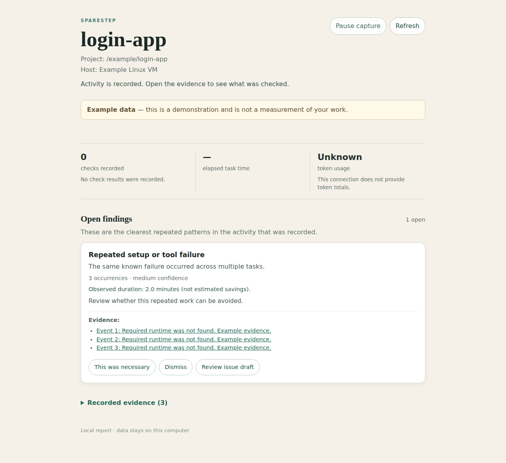

# Sparestep

**Help Codex do less busywork.**

Sparestep records your Codex activity and explains recurring problems worth fixing. Read a short report, tell it when work was necessary, and turn a useful finding into an editable Linear issue draft.

It runs locally on Linux, including a VM accessed only through SSH. Recording makes no AI calls.



## Try it

Download the Linux installer from [the release](https://github.com/ArchieOS-org/sparestep/releases/tag/v0.1.0), then run:

```sh
sh install.sh
~/.local/bin/sparestep demo
```

The installer verifies the binary's checksum. It needs `curl` and `sha256sum`; it does not need root, a compiler, or a database server.

Prefer a browser? Run:

```sh
~/.local/bin/sparestep serve --demo
```

Open the address it prints. Example data is labeled and kept separate from your recordings.

## Connect your project

In the project where Codex runs:

```sh
~/.local/bin/sparestep connect
```

Open Codex in that project. Review the project's hooks using `/hooks` and trust the Sparestep entries. This is Codex's own required review before hooks run. If the project is untrusted or hooks are disabled, Codex will not record its activity. [Codex hook setup](https://learn.chatgpt.com/docs/hooks)

After a task, run:

```sh
~/.local/bin/sparestep doctor
~/.local/bin/sparestep
```

The terminal guide lets you inspect findings, mark work necessary, dismiss or restore suggestions, and save issue drafts. `doctor` distinguishes an installed connection from recorded activity.

## Using a Linux VM?

Run Sparestep on the VM where Codex runs. Everything works in the SSH terminal.

To use your own computer's browser, run `sparestep serve` on the VM. Follow its SSH forwarding instruction **on your computer**, then open the printed browser address there. The VM needs no browser, desktop, GPU, or public web port. Records stay on the VM.

Closing the report does not stop hook recording. Recording follows Codex; Sparestep does not keep Codex itself alive after an SSH disconnect or reboot.

## What the preview can tell you

- A known setup or tool failure happened across multiple tasks.
- Which supported checks returned a known pass, failure, or unknown result.
- The recorded duration of attempts, when available.

Native shell results supplied only as text remain **unknown**. Recurring findings need structured failure evidence, such as an MCP tool's error response. This preview will therefore miss many ordinary shell failures.

Repeated-check and repeated-read detectors require reliable unchanged-context evidence. Ordinary Codex hooks do not provide all of that context, so those detectors abstain on incomplete observations. A repeated command alone is not proof of waste.

**Actual token totals are unavailable from this initial hook connection.** Hosted tools and some remote activity are also outside its coverage. It does not claim proven savings, correct code, or successful deployment from a passing command.

## Your feedback becomes useful work

Choose **Review issue draft**, edit the title and description, then download Markdown or open the draft in Linear. Nothing is submitted automatically. You can link an existing Linear issue instead. Opening Linear is never reported as a created issue.

## Stay in control

```sh
sparestep pause              # Stays paused across restarts
sparestep resume
sparestep disconnect         # Remove only the Sparestep project hooks
sparestep prune --days 30    # Remove older observations
```

State lives under `~/.local/state/sparestep`, or `$XDG_STATE_HOME/sparestep`. Use `--state-dir` or `SPARESTEP_STATE_DIR` for a different location. Project options go before finding IDs; `sparestep help` shows examples.

Automatic learning is reserved for a later version, with review, a budget, and undo.

For development and exact limitations, see [the developer guide](docs/DEVELOPMENT.md), [preview validation](docs/VALIDATION.md), and [the product plan](docs/PLAN.md). This fork retains the upstream [license](LICENSE); it has not been relicensed.
