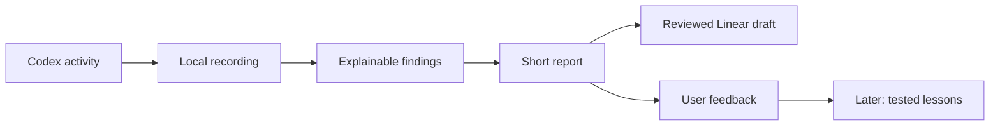

# Sparestep

**Help Codex do less busywork.**

Sparestep watches a coding task and shows where effort may have been avoidable. It explains what happened, why it matters, and what you can do about it. Recurring problems can become Linear issues. Useful checks stay useful.

This is the original product and implementation plan, dated September 8, 2026. A first preview now implements the terminal/browser reports, recording foundation, conservative findings, feedback, and Linear drafts. See DEVELOPMENT.md for actual coverage and remaining milestones; the targets below are not claims of measured savings. The repository review used `one-shot-tally` revision `c490db4`; local integration research used Codex CLI `0.153.4`.

## The product in one minute

You connect Sparestep once, then use Codex normally. After a task, you can open a small report in your browser or terminal. On a Linux VM, recording runs on the VM and the browser can stay on your own computer:

> **Fix the login redirect**
>
> Checks passed after the last edit.
>
> **One thing could be easier next time.**
> Codex hit the same missing setup dependency in three tasks.
> Those failed attempts took 2 minutes in total.
>
> **Review issue draft** · This was necessary · Dismiss
>
> View evidence

This is an illustrative report, not a measurement from this repository. The two minutes describe recorded attempts, not guaranteed future savings.

The first version helps you notice and fix repeatable causes of wasted effort. Later versions can offer a small suggestion to Codex before a known mistake repeats. Learning is a separate, optional stage.

**Name:** Sparestep. **Repository and command:** `sparestep`. The name suggests sparing unnecessary steps. A preliminary web search did not surface a directly competing coding product under that name; package, repository, and name availability still need checking before release.

## What “Jobsian” means here

- One job: make avoidable AI work understandable and actionable.
- One setup: connect, verify, and show an example without editing configuration by hand.
- One readable answer: what happened, why it might be avoidable, and the next useful action.
- Quiet operation: capture should use no model calls and add no routine prompt text.
- Details appear when requested. The front page has no scores, grades, weighted calls, or hook terminology.
- Quality is part of efficiency. Skipping a useful test is a regression, even if it saves time.

The target user already uses Codex but has never configured an agent hook or read a trace. They should understand the product before learning how its internals work.

## First-use experience

Linux VM support, including a headless VM accessed over SSH, is a first-release requirement. Provide a browser view and a complete terminal workflow. Support macOS through the same product packaging once verified. Do not promise Windows support before testing it.

1. **Open Sparestep.** Offer “See an example” and “Connect Codex.” On a headless VM, show these choices in the terminal. The example works without Codex, an account, or API keys.
2. **Choose the project.** Detect the installed Codex version and show the selected folder. Explain: “Sparestep records activity for this project on this computer.”
3. **Connect.** Install only the required integration, preserve existing settings, and run a harmless connection check. Show “Connected,” “Some activity is unavailable,” or “Connection needs attention,” with one specific next action.
4. **Use Codex normally.** No mandatory task entries, extra launch ritual, or repeated instructions to maintain a score.
5. **Open the result.** Show at most three actionable findings. A clean run says “No clear opportunities found in the activity we recorded.”

The report has three levels: a short summary, a finding with its explanation and action, then technical evidence. Keep Pause, Resume, and Remove connection easy to find. Removing the connection leaves the user's other Codex settings intact; deleting stored history is a separate choice.

Proposed commands, to be implemented: `sparestep` opens first-time setup or the report, using the terminal on a headless host; `sparestep serve` offers the browser view and prints remote-access instructions when needed; `sparestep status` prints a short terminal report; `sparestep pause` and `sparestep resume` control capture. Advanced diagnostics stay out of onboarding.

First-use copy uses “task,” “check,” “repeated work,” and “issue draft.” Explain tokens only where shown: “Units of text processed by the AI.” Put the detailed input, cache, and output breakdown behind “Usage details.”

## Using it on a Linux VM

The VM runs Codex, the recorder, and the local data store. You choose where to read the results:

| Access | Experience |
| --- | --- |
| SSH terminal only | Run `sparestep` to read findings, inspect evidence, mark work necessary, dismiss findings, and review/export issue drafts |
| Browser on your own computer | Run `sparestep serve` on the VM, follow the printed SSH forwarding instruction, and open the forwarded local address on your computer |
| Linux desktop or VM with a GUI | Open the same browser interface locally; desktop notifications are optional |

Setup must explain which command runs on the VM and which runs on your computer. It prints the actual selected port and an SSH forwarding example with a clearly labeled host placeholder. It never tries to launch a browser on a headless VM. Port conflicts produce an alternative address and updated instructions.

Core recording, reporting, feedback, and draft export require no desktop session, GPU, display server, system keychain, clipboard service, or notification service. On SSH, “Open in Linear” can print a link for your computer; “Save draft” writes Markdown on the VM. Show the host and project on every report so remote files are not confused with files on your computer.

Capture must continue when the report window closes or SSH disconnects, for as long as Codex itself continues running. The recorder does not keep Codex alive or restart its tasks. Use per-user storage and installation without root access. If a background service is needed, support an optional user service and a documented foreground process for hosts without a user service manager; core hook recording must not depend on the report server being open. VM reboot preserves records and deduplication state. Pause persists across reconnects and restarts.

Setup states whether any optional service starts after reboot and supplies the restart command for manual operation. If storage is full or unavailable, report a recording gap without blocking Codex. A feedback or draft action is acknowledged as saved only after it is durable.

Release Linux binaries for x86_64 and arm64, with tested distribution/runtime requirements documented. Verify on a clean headless VM, not only a developer workstation. Browser access uses SSH forwarding to a loopback-only, authenticated service, with no public ingress port required. Reporting and local drafts work offline; external issue submission requires connectivity.

Running Codex CLI on the VM is the baseline supported workflow. A desktop client controlling a remote VM needs its own integration check: observe activity where it executes and disclose missing host data. A desktop connection by itself does not prove VM activity is recorded.

## Decide what deserves attention

Repetition is an observation. Avoidability is a judgment that needs context. The product must be willing to say it cannot tell.

| Situation | How Sparestep should treat it | Useful next step |
| --- | --- | --- |
| A test runs after a relevant edit | Useful verification | Leave it alone |
| A failed test is rerun after an environment repair | Useful recovery or uncertain | Leave it alone unless a separate recurring cause is evident |
| A previously passing check repeats with the same relevant inputs and no new requirement | Possible avoidable repetition | Explain the evidence; allow “This was necessary” |
| The same setup error occurs across tasks | Recurring project or tooling problem | Offer one grouped issue draft |
| The same read repeats after compaction, or the earlier result was incomplete | Context recovery or uncertain | Do not call it waste merely because the command matches |
| Codex waits for a build it needs | Necessary waiting | Do not count the whole wait as avoidable |
| Many polls return no new information when a supported completion signal exists | Possible inefficient waiting | Suggest the supported alternative; distinguish poll overhead from build duration |
| A tool returns an oversized result and Codex searches it again | Possible opportunity to narrow retrieval | Report output size; do not invent exact token savings |
| A project instruction requires the expensive action | Explain the requirement if its source is known | Consider an issue about the instruction or workflow |
| An instruction from Codex or a tool integration requires the action | Constrained behavior, not freely chosen agent behavior | Identify the constraint; route feedback to a changeable component |
| A subagent investigates an independent problem | Potentially useful parallel work | Judge the result and overlap, not the mere existence of delegation |

The first release implements only three finding families: repeated successful checks, recurring setup/tool failures, and repeated unchanged reads. Start conservatively with tool types whose inputs and results can be compared reliably. Add polling and oversized-output findings only when the chosen integration supplies the necessary evidence.

A repeated-check comparison considers command arguments, working directory, relevant files, untracked inputs where applicable, dependencies, environment identity, prior result, and explicit verification requirements. If these are incomplete, lower confidence or abstain. Git HEAD alone is insufficient. Do not scan the entire repository after every call.

Each detector declares the context it requires. If missing compaction, instruction, or environment information could explain the repetition, disable that detector's avoidability claim for those events. A factual “this repeated” entry can remain in the evidence view without becoming an actionable waste finding.

Do not flag exploratory research, review, tests, or delegation solely because they took time. Arbitrary natural-language scope expansion remains a later, optional analysis feature. V1 cannot determine with certainty whether every action was necessary.

Each finding contains a one-sentence explanation, supporting observations, what remains uncertain, measured impact if available, recurrence, and one suggested action. “This was necessary” and “Dismiss” suppress the relevant suggestion within a visible scope and can be undone.

## Linear: turn repeated friction into a fix

Linear is optional. The first useful report must not depend on connecting it.

The initial path is **Review issue draft → edit → Open in Linear**. Linear officially supports links that prefill an issue form without an API integration. Opening the form does not prove an issue was created. Keep “Copy issue” available for long or sensitive descriptions, and allow the user to link an existing issue. [Linear prefilled issue forms](https://linear.app/developers/create-issues-using-linear-new)

Group by project, affected component, and supported cause. Ten observations of one cause should produce one suggestion. Cross-task recurrence improves priority; a single reproducible defect can also justify a draft. A long test run alone does not.

An issue draft answers four questions:

| Field | Example |
| --- | --- |
| What is broken? | Project setup does not check for the required runtime |
| What did we observe? | Three tasks encountered the same missing-runtime error; recorded failed attempts totaled two minutes |
| What should change? | Add a runtime check and a working setup instruction |
| How will we know it is fixed? | A fresh supported checkout completes setup; missing prerequisites produce one actionable message |

Examples are illustrative. Actual drafts must link their observations, name versions when relevant, and distinguish the suspected cause from verified facts. Export only the text the user reviewed. A local evidence link is useful locally but should not be presented as accessible to teammates; include a concise sanitized excerpt or portable evidence summary when needed.

Later, offer “Create in Linear” through OAuth with narrowly scoped permissions and a user-selected team. Keep a durable export record and reconcile ambiguous submissions before retrying. A network timeout must not create duplicate issues. Do not assume a general issue-create idempotency key; the application owns deduplication. Inspect GraphQL errors as well as HTTP status. [Linear OAuth](https://linear.app/developers/oauth-2-0-authentication), [GraphQL creation](https://linear.app/developers/graphql)

The first version records “Opened in Linear” until the user links the resulting issue. Automated creation is a later opt-in workflow, restricted to configured projects, issue classes, and submission limits. It is not the default.

## Learning: leave room now, earn automation later

Hermes supplies a useful reference: bounded persistent memory, reusable skills, and reviewable changes. These mechanisms save facts and procedures; they do not automatically train the underlying model. Its documentation also notes that background reviews can consume substantial tokens. [Hermes memory](https://hermes-agent.nousresearch.com/docs/user-guide/features/memory/), [Hermes skills](https://hermes-agent.nousresearch.com/docs/user-guide/features/skills/)

For Sparestep, implement the records now and defer the learning engine:

1. Record the finding, its evidence, and the user's judgment.
2. Later, propose a short project-specific lesson, such as “Use the documented setup command before the first build.”
3. Show the proposed instruction and the cases where it should not apply.
4. Compare it with the existing behavior on representative tasks and separate evaluation cases.
5. Enable the reviewed lesson only within its scope. Keep its version, expiry/revalidation conditions, and undo.

Possible lifecycle: `proposed → reviewed → tested → enabled → retired`.

Do not silently rewrite `AGENTS.md`, change approval rules, or create always-loaded skills from arbitrary tool output. A closed Linear issue is feedback, not automatic proof that a new instruction is safe or useful. Prefer fixing a broken script or document over permanently teaching the agent a workaround.

Future learning should batch related evidence outside active work, use a user-set hard token or money budget, stop when that budget cannot be enforced, and show its own usage. Retrieve a relevant lesson when needed instead of injecting an expanding history into every prompt. Learning remains disabled by default until it demonstrates a net improvement.

Hermes Curator's provenance and rollback are useful patterns. Its separate self-evolution project also discusses evaluation-based instruction optimization, with some stages still planned; do not treat that roadmap as a finished capability. [Curator](https://hermes-agent.nousresearch.com/docs/user-guide/features/curator), [Self-evolution project](https://github.com/NousResearch/hermes-agent-self-evolution)

## What to carry over and what to remove

This comparison specifies behavior, not permission to copy implementation.

| Carry forward | Replace or remove |
| --- | --- |
| Explicit evidence for passed, failed, and unknown results | Overall grades and weighted-call allowances |
| Checks associated with the relevant edit | Counting an identical test command as redundant regardless of intervening edits |
| Protection against stale and out-of-order results | Recovery celebrations and score bonuses |
| Tracking incomplete operations across turns | Stop hooks that make Codex continue merely to satisfy the recorder |
| Concurrency and corrupt-state recovery requirements | Mandatory manual TODO and background-job bookkeeping |
| Quiet capture | Credential mail, Trash/file guards, fleet SSH, goal management, and bundled browser repairs |

The code audit found the repeated-test problem in [main.go:568](https://github.com/Leopere/one-shot-tally/blob/c490db4/main.go#L568) and its duration accounting in [main.go:713](https://github.com/Leopere/one-shot-tally/blob/c490db4/main.go#L713). The current core uses counts and aggregate test duration rather than a complete action timeline. Its goal-history feature has separate token data, but the work-cycle report does not attribute actual tokens to actions. The default [installer](https://github.com/Leopere/one-shot-tally/blob/c490db4/install.sh) also bundles macOS-specific file tools and does not enable capture hooks.

## Integration and architecture

Use a small Go application with an embedded local browser interface, terminal interface, and SQLite storage on the execution host. Ship prebuilt binaries; end users should not need Go, Node, Swift, or a separate database install. Browser and terminal actions share the same finding, feedback, and export logic. Keep capture, diagnosis, issue export, and future learning separate.

**Verify the connection before promising coverage.** Current Codex documentation describes hooks for supported local tools, with gaps including hosted web search. It also says transcript format is not a stable hook interface. Use hooks as a bounded observation source, and make missing coverage visible. [Codex hooks](https://learn.chatgpt.com/docs/hooks)

The app-server documentation describes command durations, exit codes, item events, and token-usage notifications. Availability of those fields does not prove an external companion can passively subscribe to every existing desktop task. [Codex app server](https://learn.chatgpt.com/docs/app-server)

The first implementation spike must prove a supported observation path for the user's normal Codex workflow. Prefer passive project-scoped hooks plus a supported read-only usage source. Test CLI and desktop separately. Do not resume, fork, or restart a user's task just to observe it. If passive desktop token access is unavailable, show “Token usage unavailable in this connection”; ship a clearly labeled time/activity preview rather than a claimed token-saving product. A managed app-server launch mode is a separate later option, not a hidden onboarding requirement.

Context7 was actually queried through its REST API, resolving `/openai/codex` and retrieving protocol and hook documentation. The installed CLI schema independently confirms task/turn usage fields and token breakdowns. Schema presence is not a live integration test. [Context7 Codex index](https://context7.com/openai/codex)

**Minimum internal records:**

| Record | Required information |
| --- | --- |
| Observation | Schema/source version, project, task/turn/agent/parent IDs when available, tool/operation ID, start/end, normalized input identity, relevant state references, result certainty, provenance, capture gaps |
| Usage | Source, interval or request/task identity, cumulative versus incremental semantics, input/cached/output/reasoning counters where available, measurement status |
| Finding | Stable ID, detector version, category, evidence IDs, explanation, confidence, recurrence, impact with provenance, user disposition, grouping key |
| Export | Finding/draft ID, destination, reviewed content hash, submission state, external ID/URL if confirmed |
| Lesson proposal | Evidence and finding IDs, scope, trigger, proposed instruction, counterexamples, status/version, evaluation, review cost, rollback reference |

Keep the observation schema versioned and append-only in meaning. Derived findings can be recalculated. Deduplicate events, tolerate out-of-order completion, preserve explicit unknown states, and distinguish shared sessions from individual subagents. Capture failures must not prevent Codex from completing its work.

Store bounded sanitized metadata and excerpts by default, not whole transcripts or private reasoning. Preserve comparable identities with local hashes where appropriate. Read additional evidence only for the selected task. Local history defaults to 30 days; offer deletion and a shorter retention setting. Bind the browser service to loopback with an authenticated session and protect local write endpoints.

**Measurement rules:**

- Report elapsed task time separately from summed tool time. Parallel intervals must not be added and presented as user waiting time.
- Treat tokens as measured only when supplied by an identified usage source. Distinguish cumulative snapshots from increments; reconcile resets, forks, and child aggregation.
- Cached input and reasoning output may be subdivisions of other counters. Follow source semantics instead of adding every field together.
- Task-level tokens do not establish the cost of a particular action. During parallel work, attribution may remain unknown.
- Output size is an observation; an estimated token count is a labeled estimate. Neither proves tokens saved.
- “Time spent on these attempts” is different from “Time you will save.” Counterfactual savings require a comparison.
- Do not display dollar savings for subscription usage. Later API cost estimates need a dated model price source and billing-aware accounting.
- Attribute capture, optional analysis, issue export, and learning overhead to Sparestep itself.

## Build sequence and completion criteria

These are planned work packages, not Linear issues already created. Work proceeds in order of dependency; UI fixtures and detector fixtures can proceed independently after the contracts are agreed.

| Stage | Deliverable | Done when |
| --- | --- | --- |
| 0. Establish reuse route | Confirm existing written rights or permission; choose code fork or independent implementation | The implementation and intended distribution have an explicit permitted route |
| 1. Prove observation | Version/host capability matrix, headless Linux VM sample events, token semantics, overhead baseline | Normal Codex work on the VM is observed without changing the task; coverage gaps are explicit |
| 2. Make the first report understandable | Guided browser and SSH setup, sample report, short summary, evidence expansion, pause/remove | At least four of five first-time testers finish setup without help and can explain the sample in 30 seconds; include SSH users |
| 3. Record trustworthy activity | Versioned local event store, operation/result matching, usage reconciliation | Restart, duplicate, parallel, missing-result, and stale-event fixtures preserve the correct facts |
| 4. Find three useful patterns | Conservative detectors and necessary/dismiss feedback | Labeled replay cases catch supported repetition while preserving useful checks and recovery |
| 5. Turn findings into work | Grouped editable drafts, copy/open/link actions | Repeated observations yield one draft; opening Linear is never reported as confirmed creation |
| 6. Release a useful preview | Linux x86_64/arm64 binaries, clean-VM checks, other verified-host packages, concise README, uninstall | Full terminal workflow and forwarded browser access work without a VM desktop or root; no required compiler/database setup |
| 7. Prove savings | Comparable task evaluation, quality review, overhead report | Lower avoidable effort does not worsen correctness or completion, and savings include product overhead |
| Later | OAuth issue creation; bounded contextual suggestions; reviewed lessons | Each feature meets its own benefit, budget, failure-recovery, and undo gates |

Stage 0 does not prevent authoring the specification, UX examples, or integration research. The local [LICENSE](../LICENSE) explicitly withholds modification and redistribution rights without a separate written agreement. Confirm whether such an agreement already exists. If it does not, seek permission before reusing code. If permission is unavailable, create an original implementation from the product requirements instead of copying protected implementation or documentation.

The implementation now lives at [ArchieOS-org/sparestep](https://github.com/ArchieOS-org/sparestep), with upstream history and required notices retained. Keep the original `one-shot-tally` checkout as a reference. Put new state under the new product name. Any import of old aggregate data is optional and labeled as incomplete historical evidence.

For an independent implementation, start a new repository without upstream code/history and choose an explicit license for the original work.

## How we know this is helping

The primary outcome is less developer waiting and less avoidable agent work on comparable tasks, with quality preserved. V1 observation alone does not cause savings; improvements should come from acted-on findings, repaired project friction, or later measured suggestions.

Proposed release targets, to validate rather than advertise as achieved:

- Passive capture uses zero model calls and adds no routine model-facing report.
- Added capture latency is below 20 ms at the 95th percentile per event and below 1% of elapsed time on representative task replays, including serialization and process overhead.
- At least 90% of surfaced findings in a reviewed pilot are judged actionable; report the sample size and uncertainty. Never-call-it-waste cases include test reruns after relevant edits, required checks, legitimate retries, and recovery after compaction.
- The UI shows no more than three findings per completed task, grouped by cause. Unchanged dismissed findings do not return as new alerts.
- Five new-user sessions test comprehension and setup; keyboard navigation, screen-reader labels, readable contrast, and empty/error states are part of completion.
- Linux VM acceptance covers fresh installation without a GUI, SSH-only setup and feedback, authenticated browser access through SSH forwarding, no display/clipboard/keychain dependencies, unavailable outbound network, occupied ports, SSH disconnect/reconnect, VM reboot, persistent pause, and safe removal of the connection. Confirm recorder survival only while Codex remains running; do not imply task survival is provided by Sparestep.
- Controlled task comparisons review the actual result and required verification. Use multiple runs where variance matters and count review/learning overhead. A small replay suite validates accounting, not real-world savings by itself.

The product should earn expansion in this order: **understand the work → fix recurring friction → suggest a better next step → learn a tested habit.**
